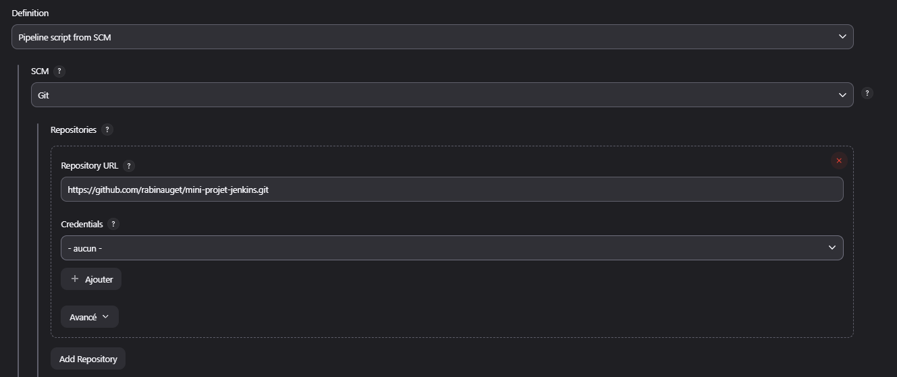
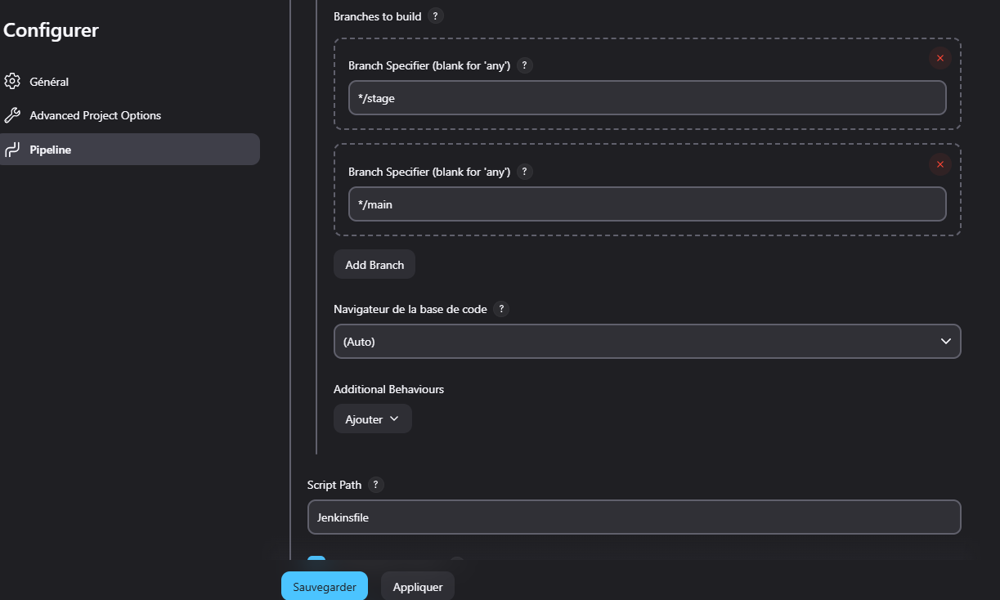

# MINI PROJET JENKINS

Ce mini projet est dans le cadre du bootcamp Devops de Eazytraing

**Nom** : AUGET

**Prénom** : Rabina

**Pour la promotion 19 du Bootcamp DevOps**

**Période** : Mai - Juin - Juillet 2024

**Date de réalisation**: 30 Juin 2024

**LinkedIn** : www.linkedin.com/in/auget-rabina-61663314a

# Contexte du projet

Ce projet a pour objectif de mettre en place un pipeline CI/CD (Intégration Continue et Déploiement Continu) afin d'automatiser et d'optimiser le processus de livraison et de déploiement d'une application Web classique (HTML/CSS/JS) en utilisant Jenkins. Cela permettra de réduire les erreurs manuelles de déploiement, d'accélérer les mises à jour ou publication de fonctionnalité et d'assurer une intégration fluide et homogène à chaque étape grâce à Jenkins.

Le pipeline sera déclenché à chaque push de code vers Github, assurant que les nouvelles modifications sont automatiquement compilées et validées par un test, avant d'être déployées en production.

# Application

Ci-après les différents fichiers dont nous allons avoir besoin:   

+ **Jenkinsfile :** où nous allons énumérer toutes les étapes du pipeline CI/CD.
+ **Dockerfile :** nous servira à créer l'image docker de l'application pour pouvoir le conteneuriser.
+ **nginx.conf :** Nous allons utiliser NGINX comme serveur web, et ce fichier servira de fichier de configuration pour celui-ci.
+ Le code source de l'application sera récupéré directement depuis le dépôt GitHub et intégré à l'image Docke: https://github.com/diranetafen/static-website-example.git

# Fonctionnement du pipeline

Le pipeline CI/CD sera structuré en plusieurs étapes clés:

1. **La phase de Build :** Cette étape consiste à construire une image Docker à partir du code source.

2. **La phase de Test de l'image :** L'image Docker construite est testée pour garantir son bon fonctionnement.

3. **La phase de sauvegarde de l'image (Release image) :** L'image validée est poussée dans un registre Docker pour une utilisation future.

4. **La phase de Déploiement en staging :** L'image est déployée sur l'environnement de staging pour des tests plus complet.

5. **La phase de Test sur l'environnement staging :** Des tests sont effectués sur l'application déployée en staging pour valider son comportement.

6. **La phase de Déploiement en production :** Une fois validée, l'image est déployée dans l'environnement de production pour les utilisateurs finaux.

# Infrastructure et techno

Voici les technos que j'ai utilisé pour réaliser ce mini-projet:

+ **My laptop:** Windows 11 avec un CPU intel core i7-8ème 2.1GHz et 16GB RAM
+ **Hôte serveur:** Droplet 2CPU/4GB RAM/120G SSD sur DigitalOcean
+ **Jenkins:** Jenkins version 2.479.2 installé sur le serveur de droplet via Docker-Compose: https://github.com/rabinauget/jenkins-docker-image.git
+ **Heroku :** Et pour déployer l'application, j'ai déployé sur Heroku qui est une plateforme de déploiement d'application en ligne (https://www.heroku.com/)

# Installation du plugin nécessaire

1. Une fois Jenkins installé et correctement configuré, il faut dans un premier temps installer le plugin `Github Integration` afin que Jenkins puisse recevoir les notifications de push et ainsi, pouvoir enclencher le lancement du pipeline. 

Pour ce faire, aller dans **Tableau de bord** => **Administrer Jenkins** => **Plugins** => **Plugins disponibles** => **Rechercher le plugin** => **Cocher la case** => **Installer**

# Connexion de Jenkins à Dockerhub

2. Maintenant, comme l'image sera envoyé vers github pour une réutilisation future, il faut que Jenkins puisse s'authentifier à Dockerhub. Donc il faut déclarer les identifiants de Dockerhub dans Jenkins.

Aller dans **Tableau de bord => Administrer Jenkins => Credentials => Global => Add Credentials, et remplir les champs comme ceci**:

+ **Type:** Nom d'utilisateur et Mot de passe
+ **Portée:** Global
+ **Nom d'utilisateur:** (Nom d'utilisateur du compte Dockerhub)
+ **Mot de passe:** (Mot de passe du compte Dockerhub)
+ **ID:** (J'ai mis dockerhub mais on peut mettre ce qu'on veut du moment que ça nous permet de reconnaître que c'est le compte dockerhub)
+ **Description:** (Une briève description)

# Connexion de Jenkins à Heroku

3. Faire pareil pour Heroku étant donné que l'application va être déployer sur notre compte Heroku mais à la différence c'est que sur Heroku, on ne va pas utilise le nom d'utilisateur et mot de passe mais un API_KEY.

Donc dans un premier temps, il faut aller prendre l'API_KEY sur Heroku:

+ Il faut se connecter avec notre compte sur Heroku
+ Puis aller dans **Dashboard** => **Account** => **Dans la section API Key**, cliquer sur `Reavel`
+ Copier l'API Key
+ Revenir sur Jenkins faire la même procédure que quand on a créé le credential de dockerhub, mais la différence c'est que le type de crédential n'est pas un nom d'utilisateur et mot de passe mais un `Secret text`:

+ **Type:** Secret text
+ **Portée:** Global
+ **Secret:** Coller l'API key ici
+ **ID:** Ici, il faut mettre exactement `HEROKU_API_KEY` (En majuscule ou en miniscule)
+ **Description:** (Une briève description)

# Configuration du Webhook sur Github

4. Les identifiants nécessaires à l'exécution du pipeline étant configurés dans Jenkins, il reste à ajouter un `Webhook` sur le projet GitHub pour notifier automatiquement Jenkins à chaque push.

Pour ce faire, dans le dépôt Github de notre projet, aller dans **Settings** => **Webhook** => **Add Webhook**:

+ **Payload URL** : Mettre l'URL de notre Jenkins et ajouter `github-webhook/` à la fin (ne pas oublier le / à la fin) 
+ **Content type** : application/json
+ **Secret** : (Je laisse vide mais ça dépend de votre configuration)
+ **Enable SSL**: si le certificat SSL est activé sur votre Jenkins
+ **Which events would you like to trigger this webhook?** : On peut juste cochez `Push event` mais le souci c'est que quand vous faire un merge request et qu'ensuite vous faites un push depuis le local, le pipeline ne sera pas déclencher donc j'ai mis `Let me select individual events` et cocher **Pushes** & **Merge groups**.
+ **Add webhook**

5. Le webhook va apparaître comme ceci donc il faut cliquer sur le lien de Jenkins

6. Après avoir cliqué sur le webhook, rendez-vous dans `Recent Deliveries` pour confirmer que la requête de ping a été effectuée avec succès. Si elle échoue, vérifiez que le plugin `GitHub Integration` est bien  installé dans Jenkins et que l'URL de Jenkins dans le webhook est correctement configurée avec le `/`.

# Création du Pipeline

7. Les prérequis étant terminés, on peut maintenant procéder à la création de notre pipeline:

Dans **Tableau de bord** => **Nouveau Item** => **Saisir le nom du pipeline** => **Selectionner Pipeline** => **OK**

8. On est redirigé vers la page de configuration de notre pipeline qui contient trois sections:

+ Général
+ Advanced Project Options
+ Pipeline

Dans la section Générale:

Cocher `Github project` et collez ici le lien Github du projet: Dans mon cas, c'est celui du mini-projet-jenkins

**Lien du projet sur Github**

**Projet Github dans Jenkins**

Cocher ensuite `Github hook trigger for GITScm polling` pour dire à notre pipeline qu'il attend un déclencher de la part du repo mini-projet-jenkins depuis Github

**Build Triggers**

Dans la section Pipeline:

+ **Sur Definition** : choisir `Pipeline script from SCM`
+ **SCM** : Mettre `Git`
+ **Repository URL** : Coller à nouveau le lien Github du projet

Sur la partie `Branche to build`, je vais mettre `stage` et `main` vu que je vais utiliser ces deux branche pour déployer sur l'environnement de staging et de production.

On peut maintenant cliquer sur `Sauvegarder`.

# Test manuelle du pipeline

9. Après avoir terminer la création du pipeline, je l'ai lancé manuellement avec le bouton `Lancer un build` pour test et ça s'est terminé avec succès.

Dans la capture, on voit qu'il a sauté la partie Staging car la branche par défaut de mon dépot Github est la branche `main` qui est associé au job de déploiement sur la production.

# Test de push vers l'environnement de staging

10. Afin de confirmer que le Webhook fonctionne correctement, je vais faire un test de push vers le staging. Cela devrait déclencher le pipeline pour qu'il deploie vers le staging.

Aussitôt qu'un push vers la branche `stage` a été effectué, le pipeline s'est lancé et on voit bien qu'il a sauté le déploiement vers la prod, conformément aux instructions indiqués dans le fichier Jenkisfile. Je vous mets à disposition le fichier de log d'execution (Deploiement en staging.txt).

11. On peut voir que l'application a bien été déployé en staging.

# Test de push vers l'environnement de production

12. Maintenant, je vais faire:

+  un push vers la branche `stage`
+  faire un merge de la branche `stage` vers la branche `main`
+  et pour terminer, faire un push des modifications vers la branch `main`

13. Dès que le push vers la branche `main` a été effectué, le pipeline s'est lancé pour déployer vers la production comme indiqué dans le Jenkinsfile. Et le pipeline s'est bien terminé. Le fichier de log se trouve dans le dossier log du repos (Deploiement en production.txt).

14. Pour confirmer que tout s'est bien passé, on vérifie l'URL et on verra que l'application a bien été déployé en production.

# Vérification de l'image sur Dockerhub

15. Si on vérifie sur Dockerhub après les executions du pipeline, l'image est bien présent dans notre espace.

# Notification Slack

16. À la fin du fichier Jenkinsfile, la section `post` est utilisée pour envoyer des notifications à un canal Slack une fois que le pipeline a terminé l'exécution des jobs.

Pour le configurer:

Sur Slack,

+ il faut commencer par créer un canal
+ installer l'application Jenkins
+ Slack va donner un token

Sur Jenkins,

+ il faut installer le plugins `Slack notification`
+ une fois installé, déclarer le token au niveau de Jenkins dans credentials avec comme type `secret text`
+ ensuite aller dans **Tableau de bord** => **Administrer Jenkins** => **dans la section Slack**, remplir comme ceci:

+ **Workspace:** le nom de l'espace de travail
+ **Credential:** sélectionner le credential qui vient d'être créer
+ **Default channel / member id:** mettre le nom du canal
+ **Test Connection**: On verra un success si tous ce passe bien

17. Et une fois le tout configuré, on peut voir que les notifications ont bien été reçu sur Slack

# Conclusion

Ce mini-projet a permis de mettre en place une solution CI/CD complète et automatisée pour le déploiement d'une application web classique. Grâce à l'intégration de Jenkins, Docker, et Heroku, le processus de livraison est devenu rapide, fiable et reproductible. Chaque modification apportée au code source déclenche automatiquement un pipeline structuré, garantissant la qualité et la disponibilité de l'application à chaque étape. Enfin, l'ajout de notifications Slack permet une supervision en temps réel des activités du pipeline, renforçant ainsi la collaboration et la réactivité de l'équipe.
